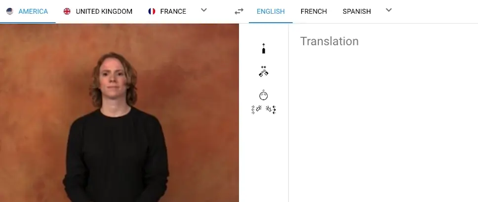

<h1 align="center">👋 Conexus</h1>

<p align="center">
  <i>
    Revolutionizing Sign Language Communication with Cutting-Edge Real-Time Translation Models.
    <br>
    Enjoy seamless Sign Language Translation on desktop and mobile.
  </i>
</p>

<p align="center">
  <a href="https://sign.mt/"><strong>sign.mt</strong></a>
  <br>
</p>

<p align="center">
  <a href="https://github.com/sign/.github/blob/main/CONTRIBUTING.md">Contribution Guidelines</a>
  ·
  <a href="https://github.com/conexus/issues">Submit an Issue</a>
</p>

<p align="center">
  <a href="https://github.com/conexus/actions/workflows/client.yml">
    
  </a>
  <a href="https://github.com/conexus/actions/workflows/server.yml">
    
  </a>
  <a href="https://coveralls.io/github/conexus?branch=master">
    
  </a>
  <a href="https://github.com/conexus/blob/master/LICENSE.md">
    
  </a>
</p>

<p align="center">
  <a href="https://github.com/conexus/stargazers" target="_blank">
    
  </a>
  <a href="https://github.com/conexus/network/members" target="_blank">
    
  </a>
  <a href="https://github.com/conexus/stargazers" target="_blank">
    
  </a>
  <a href="https://github.com/conexus/issues" target="_blank">
    
  </a>
</p>

<p align="center">
  <a href="https://sign.mt" target="_blank">
    
  </a>
</p>

<hr>

## Key Features

### [Sign Language Production](https://github.com/conexus/wiki/Spoken-to-Signed)

```
┌─────────────────────┐
│Spoken Language Audio│                                                              ┌─────────┐
└─────────┬───────────┘                                                  ┌──────────►│Human GAN│
          │                                                              │           └─────────┘
          ▼                                                              │
┌────────────────────┐     ┌───────────────┐     ┌───────────┐    ┌──────┴──────┐    ┌───────────────┐
│Spoken Language Text├────►│Normalized Text├────►│SignWriting├───►│Pose Sequence├───►│Skeleton Viewer│
└─────────┬──────────┘     └───────────────┘     └───────────┘    └──────┬──────┘    └───────────────┘
          │                        ▲                   ▲                 │
          ▼                        │                   │                 │           ┌─────────┐
┌───────────────────────┐          │                   │                 └──────────►│3D Avatar│
│Language Identification├──────────┘───────────────────┘                             └─────────┘
└───────────────────────┘
```

### [Sign Language Translation](https://github.com/conexus/wiki/Signed-to-Spoken)

```
┌──────────────────────────┐                                ┌────────────────────┐
│Upload Sign Language Video│                      ┌────────►│Spoken Language Text│
└──────────┬───────────────┘                      │         └──────────┬─────────┘
           │                                      │                    │
           │          ┌────────────┐       ┌──────┴────┐               │
           ├─────────►│Segmentation├──────►│SignWriting│               │
           │          └────────────┘       └───────────┘               │
           │                                                           ▼
┌──────────┴────────────────┐                               ┌─────────────────────┐
│Camera Sign Language Video │                               │Spoken Language Audio│
└───────────────────────────┘                               └─────────────────────┘
```

### Want to Help?

Join us on the journey to revolutionize sign language communication.
Follow our progress on the [Project Board][project-board],
shape the project's future,
and delve deeper into our vision and plans in the [Wiki][wiki].

Wish to report a bug, contribute some code, or enhance documentation? Fantastic!
Check our guidelines for [contributing][contributing] and then explore our issues marked as <kbd>[help wanted](https://github.com/conexus/labels/help%20wanted)</kbd> or <kbd>[good first issue](https://github.com/conexus/labels/good%20first%20issue)</kbd>.

**Find this useful? Give our repo a star :star: :arrow_up:.**

[](https://github.com/conexus/stargazers)

[wiki]: https://github.com/conexus/wiki/Spoken-to-Signed
[contributing]: https://github.com/sign/.github/blob/main/CONTRIBUTING.md
[project-board]: https://github.com/conexus/projects/1

## Development

### Prerequisites

- Install [Node.js] which includes [Node Package Manager][npm]

### Setting Up the Project

Install dependencies locally:

```bash
npm install
```

Run the application:

```bash
npm start
```

Test the application:

```bash
npm test
```

Run the application on iOS:

```bash
npm run build:full && \
npx cap sync ios && \
npx cap run ios
```

[node.js]: https://nodejs.org/
[npm]: https://www.npmjs.com/get-npm

### Cite

```bibtex
@misc{moryossef2023signmt,
    title={sign.mt: Effortless Real-Time Sign Language Translation},
    author={Moryossef, Amit},
    howpublished={\url{https://sign.mt/}},
    year={2023}
}
```
